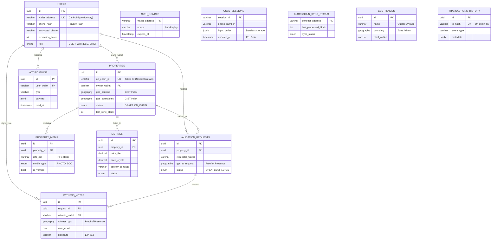

# DIAGRAMME ER - ARCHITECTURE HYBRIDE (V4.1)
## Blockchain (Polygon) + Indexer (PostgreSQL)

Ce diagramme reflète l'architecture optimisée à **12 tables**, centrée sur la synchronisation Blockchain et la validation communautaire.

### Légende Technique
*   **12 Tables Essentielles** : Couvrent l'intégralité du flux Hybride (Off-chain <-> On-chain).
*   **GIST Index** : Indique les colonnes optimisées pour la recherche spatiale (PostGIS).
*   **UK** : Unique Key.
*   **FK** : Foreign Key.
